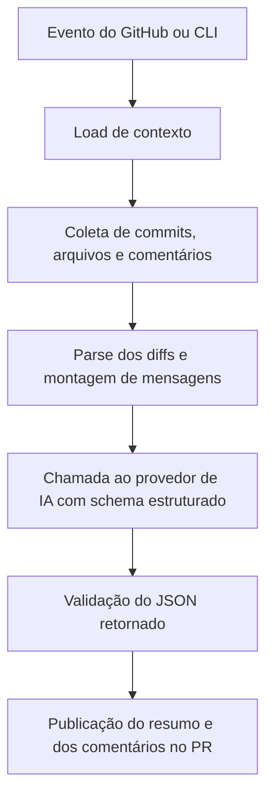

# Documentação técnica da implementação do PR Review AI

## 1. Visão geral

O repositório implementa uma GitHub Action e um CLI local para automatizar revisões de Pull Requests com apoio de modelos de linguagem. A ferramenta analisa o conteúdo do PR, resume as mudanças, gera comentários acionáveis em trechos de código e, quando necessário, responde comentários de review de forma interativa.

A proposta arquitetural é separar claramente três responsabilidades:

- Captura do contexto do GitHub e do PR.
- Construção de diffs, mensagens e prompts para o modelo de IA.
- Publicação dos resultados no GitHub ou apresentação em modo local de teste.

Na prática, a solução funciona como um pipeline:



O resultado final é uma automação capaz de revisar PRs, gerar resumo executivo, apontar riscos e responder threads de comentário, sempre com foco em manter o humano no centro da decisão final.

## 2. Estrutura do projeto

Os arquivos principais estão concentrados em `src/`, com build para `dist/` e testes em `src/__tests__/`.

```text
src/
  main.ts                 -> ponto de entrada da GitHub Action
  cli.ts                  -> interface de linha de comando para testes locais
  config.ts               -> leitura e validação de configurações
  context.ts              -> abstração de contexto do GitHub e modo debug
  octokit.ts              -> inicialização do cliente GitHub com retry/throttling
  pull_request.ts         -> fluxo principal de análise de PR
  pull_request_comment.ts -> fluxo de resposta a comentários de review
  prompts.ts              -> prompts e schemas do LLM
  ai.ts                   -> seleção do provedor/modelo e execução da inferência
  diff.ts                 -> parsing e formatação dos diffs
  messages.ts             -> montagem das mensagens publicadas no PR
  comments.ts             -> threads, assinaturas e utilitários de comentários
  providers/
    ai-sdk.ts             -> implementação para provedores compatíveis com AI SDK
    sapaicore.ts          -> implementação para SAP AI Core
```

Além disso, o repositório contém:

- `action.yml`, que define a GitHub Action publicada pelo projeto.
- `package.json`, que expõe scripts de build, execução e testes.
- `README.md`, que descreve uso, configuração e exemplos práticos.
- `src/__tests__/`, que valida os módulos centrais de forma isolada.

## 3. Ponto de entrada da action

O arquivo [src/main.ts](src/main.ts) é a porta de entrada da GitHub Action. Ele lê `GITHUB_EVENT_NAME` e escolhe qual fluxo executar:

- `pull_request` e `pull_request_target` chamam `handlePullRequest()`.
- `pull_request_review_comment` chama `handlePullRequestComment()`.
- Qualquer outro evento gera um aviso de evento não suportado.

Esse arquivo não implementa a lógica de negócio; ele apenas direciona o evento para o módulo correto e trata falhas com `setFailed`, para que o workflow seja marcado como erro quando houver exceção não tratada.

## 4. Fluxo principal de revisão de Pull Request

O coração da solução está em [src/pull_request.ts](src/pull_request.ts). Esse módulo implementa o fluxo completo da revisão automática do PR.

### 4.1. Leitura do contexto

O fluxo começa com `loadContext()`, definido em [src/context.ts](src/context.ts). Em execução normal de GitHub Actions, ele usa `@actions/github.context`. Em modo debug/local, reconstrói o contexto a partir de variáveis de ambiente e consulta o PR via GitHub API.

Esse desenho é importante porque permite reaproveitar a mesma lógica tanto no GitHub quanto no CLI local.

### 4.2. Validação e filtragem inicial

Depois de carregar o contexto, o código valida:

- Se o evento é realmente `pull_request` ou `pull_request_target`.
- Se `pull_request` existe no payload.
- Se o PR deve ser ignorado por palavras-chave como `@prreview ignore`, `@presubmit skip` e variações equivalentes.

Essa filtragem evita que a ação rode em cenários não esperados ou quando o próprio autor opta por desligar a automação.

### 4.3. Coleta de dados do PR

O fluxo principal consulta o GitHub para obter:

- Lista de commits do PR.
- Comentários de issue do PR, usados como comentário-resumo principal.
- Arquivos alterados no PR.

Os arquivos são convertidos em estruturas internas com `parseFileDiff()` para que cada diff seja dividido em trechos analisáveis.

### 4.4. Review incremental

Se já existir um comentário-resumo da ferramenta, a revisão é tratada como incremental. Nesse caso, o sistema:

- Recupera o payload embutido no comentário anterior.
- Identifica quais commits já foram revisados.
- Compara o último commit revisado com o `head.sha` atual.
- Filtra os arquivos que realmente mudaram desde a última rodada.

Isso reduz retrabalho e evita revisar novamente o que já foi analisado em uma execução anterior.

### 4.5. Comentário de carregamento

Antes de chamar o modelo de IA, a action publica ou atualiza um comentário de “analisando alterações” construído por `buildLoadingMessage()`.

Esse comentário lista:

- O commit-base e o commit mais recente analisado.
- A sequência de commits em revisão.
- Os arquivos considerados e a quantidade de trechos por arquivo.

O comentário também inclui uma assinatura interna que permite à própria ferramenta reconhecê-lo depois e fazer atualização em vez de criar duplicata.

### 4.6. Geração do resumo do PR

A função `runSummaryPrompt()` em [src/prompts.ts](src/prompts.ts) envia ao LLM:

- Título original do PR.
- Descrição original.
- Mensagens de commit.
- Lista de arquivos alterados.
- Diffs brutos dos arquivos.

O retorno esperado é um JSON estruturado com:

- `title`: título resumido do PR.
- `description`: descrição executiva.
- `files`: resumo por arquivo.
- `type`: categorização do PR, como `BUG`, `TESTS`, `DOCUMENTATION` etc.

Esse resumo é depois usado para atualizar o comentário de overview no PR e, opcionalmente, o próprio título do PR quando houver menções como `@prreview` no título original.

### 4.7. Geração da revisão técnica

Após o resumo, `runReviewPrompt()` produz uma revisão técnica detalhada a partir de:

- Arquivos já filtrados.
- Título e descrição do PR.
- Resumo gerado pela IA.

O schema de saída inclui:

- Uma avaliação geral do PR.
- Comentários de melhoria com linha inicial, linha final, label e criticidade.

Depois, a implementação filtra comentários válidos e publica os que realmente podem virar review no GitHub.

### 4.8. Publicação da revisão

O método `submitReview()` realiza a publicação final.

Ele trata dois tipos de comentários:

- Comentários soltos por arquivo, postados individualmente.
- Comentários inline associados a linhas específicas, agrupados em uma review única quando possível.

Se a criação em lote falhar, o código faz fallback e envia os comentários um a um. Essa abordagem aumenta a robustez contra limitações ou erros pontuais da API do GitHub.

### 4.9. Modo dry-run

No CLI, o fluxo pode ser executado em `--dry-run`. Nesse modo:

- Nada é publicado no GitHub.
- As mensagens finais são impressas no terminal.
- Opcionalmente a saída pode ser gravada em arquivo.

Esse modo é essencial para validação local e demonstração no TCC, porque permite testar o comportamento sem alterar PRs reais.

## 5. Fluxo de resposta a comentários de review

O módulo [src/pull_request_comment.ts](src/pull_request_comment.ts) trata eventos `pull_request_review_comment`.

O fluxo funciona assim:

1. Carrega o contexto do evento.
2. Valida se o comentário foi criado agora e se existe `pull_request`.
3. Ignora comentários gerados pela própria ferramenta.
4. Busca a thread do comentário com `getCommentThread()`.
5. Verifica se a thread é relevante por meio de assinaturas e menções específicas.
6. Recupera os diffs dos arquivos do PR.
7. Localiza o arquivo associado ao comentário.
8. Chama `runReviewCommentPrompt()` para gerar uma resposta.
9. Se a resposta exigir ação, publica um comentário de resposta na thread original.

Esse fluxo transforma a ferramenta em algo mais interativo: ela não só comenta PRs, mas também participa de discussões quando alguém responde ao review automatizado.

## 6. Configuração e validação de variáveis

O arquivo [src/config.ts](src/config.ts) centraliza a configuração da aplicação.

### 6.1. Variáveis obrigatórias

O construtor exige:

- `GITHUB_TOKEN`
- `LLM_MODEL`
- `LLM_API_KEY`

Se essas variáveis não existirem, o código interrompe a execução com erro explícito.

### 6.2. Provedores de IA

O fluxo documentado aqui usa o provedor `ai-sdk`.

Se `LLM_PROVIDER` não for definido, o padrão é `ai-sdk`.

### 6.3. Base URL e GitHub Enterprise

O sistema aceita:

- `LLM_BASE_URL` para provedores compatíveis com OpenAI via `ai-sdk`.
- `GITHUB_API_URL` e `GITHUB_SERVER_URL` para GitHub Enterprise Server.

Isso torna a implementação mais portátil e evita acoplamento ao GitHub público.

### 6.4. Regras de estilo da revisão

O projeto também aceita regras customizadas de estilo via `style_guide_rules`.

Essas regras são injetadas no prompt e podem tornar comentários críticos quando a violação conflita com o guia do projeto analisado.

## 7. Integração com o GitHub

O arquivo [src/octokit.ts](src/octokit.ts) inicializa o cliente da API com suporte a retry e throttling.

Principais pontos:

- Usa `@octokit/action` como base.
- Adiciona os plugins `retry` e `throttling`.
- Em caso de rate limit, tenta novamente até certo limite.
- Evita repetir requisições POST de revisão quando há secondary rate limit, porque esse tipo de operação é sensível a duplicação.

Esse módulo é importante para estabilidade em repositórios com muito tráfego ou PRs grandes.

## 8. Construção e interpretação dos diffs

O arquivo [src/diff.ts](src/diff.ts) converte o patch bruto do GitHub em uma estrutura mais útil para o LLM.

### 8.1. Parse de hunks

`parseFileDiff()` percorre o patch linha por linha e identifica cabeçalhos `@@` para dividir o arquivo em hunks. Cada hunk passa a ter:

- `startLine`
- `endLine`
- `diff`
- `commentThreads` relacionados, quando existirem

### 8.2. Formatação para o modelo

O módulo também oferece `generateFileCodeDiff()`, que transforma o diff em texto estruturado com:

- Cabeçalho do arquivo.
- Seções `__new hunk__` e `__old hunk__`.
- Numeração das linhas novas.
- Threads de comentário existentes no próprio trecho.

Essa estrutura é decisiva para o sucesso dos prompts, porque o LLM recebe contexto mais organizado do que um patch cru.

## 9. Comentários e assinaturas internas

O arquivo [src/comments.ts](src/comments.ts) define utilitários que evitam loops e duplicação.

Ele introduz assinaturas HTML invisíveis nos comentários gerados pela ferramenta:

- `COMMENT_SIGNATURE`
- `OVERVIEW_MESSAGE_SIGNATURE`
- tags de payload para guardar metadados do review

Com isso a implementação consegue:

- Reconhecer comentários próprios.
- Identificar threads relevantes.
- Atualizar comentários existentes sem perder histórico.
- Diferenciar comentários da ferramenta de comentários humanos.

Esse mecanismo de assinatura é um dos pontos mais importantes do design, porque permite idempotência parcial e recuperação de estado entre execuções.

## 10. Mensagens publicadas no PR

O arquivo [src/messages.ts](src/messages.ts) monta o texto visível para o usuário no GitHub.

### 10.1. Mensagem de carregamento

`buildLoadingMessage()` cria um comentário com:

- Aviso de que a revisão está em andamento.
- Lista de commits e seus links.
- Arquivos que serão analisados.

### 10.2. Mensagem de overview

`buildOverviewMessage()` recebe o resumo estruturado do PR e gera:

- Título e descrição resumidos.
- Tabela de arquivos e resumos.
- Payload interno com commits revisados.

Essa mensagem fica registrada como o comentário principal da revisão automatizada.

### 10.3. Resumo final da revisão

`buildReviewSummary()` monta o corpo do comentário final de review, listando:

- Commits considerados.
- Arquivos analisados.
- Comentários acionáveis.
- Comentários ignorados.

Assim, o PR recebe não só os comentários inline, mas também uma visão consolidada da revisão completa.

## 11. Camada de IA e validação de saída

O arquivo [src/ai.ts](src/ai.ts) concentra a lógica de escolha do provedor e da validação do formato de saída.

### 11.1. Seleção de modelo

O projeto mantém uma lista permitida de modelos por provedor. Isso evita inconsistências entre o nome informado e a capacidade real de inferência.

Se for usado `LLM_BASE_URL` com `ai-sdk`, a whitelist pode ser contornada para permitir um modelo compatível com OpenAI customizado.

### 11.2. Validação com Zod

As respostas do LLM são validadas com esquemas Zod.

Se a primeira resposta falhar na validação, o sistema tenta novamente com instruções mais rígidas para JSON puro. Essa estratégia reduz falhas ocasionais de formatação e melhora a confiabilidade do pipeline.

### 11.3. Provedores concretos

As implementações em [src/providers/ai-sdk.ts](src/providers/ai-sdk.ts) e [src/providers/sapaicore.ts](src/providers/sapaicore.ts) fazem o trabalho real de chamada ao modelo.

No caso do AI SDK:

- A biblioteca `ai` gera objetos estruturados.
- O modelo é criado a partir de `@ai-sdk/anthropic`, `@ai-sdk/google` ou `@ai-sdk/openai`.

No caso do SAP AI Core:

- O código autentica com client credentials.
- Busca deployments em execução.
- Escolhe a deployment que corresponde ao modelo.
- Chama o endpoint adequado conforme o tipo de modelo.

Isso torna a ferramenta flexível para diferentes ambientes corporativos e provedores de IA.

## 12. CLI local para testes e depuração

O arquivo [src/cli.ts](src/cli.ts) permite executar a revisão fora do GitHub Actions.

### 12.1. Comandos suportados

- Listar PRs com `--list-prs`.
- Revisar um PR com `--pr <número>`.
- Executar em `--dry-run`.
- Gravar saída com `--out`.
- Especificar `--owner` e `--repo`.

### 12.2. Valor para o TCC

Esse CLI é importante porque demonstra que a solução não depende exclusivamente do ambiente GitHub Actions. Ele facilita:

- Teste funcional local.
- Validação de prompts.
- Observação da saída antes da publicação real.

Em termos acadêmicos, isso reforça a reprodutibilidade da implementação.

## 13. Configuração da GitHub Action

O arquivo [action.yml](action.yml) define a action publicada.

Elementos principais:

- Execução via `node20`.
- Ponto de entrada em `dist/index.js`.
- Inputs opcionais para regras de estilo e URLs do GitHub Enterprise.

Na prática, o workflow usa o código compilado em `dist/`, por isso o projeto separa bem código-fonte e artefatos de build.

## 14. Papel dos testes automatizados

A suíte em [src/__tests__/](src/__tests__) cobre os blocos mais importantes da solução.

### 14.1. Configuração

`config.test.ts` valida:

- Erros quando variáveis obrigatórias faltam.
- Carregamento de `LLM_BASE_URL` e URLs do GitHub Enterprise.
- Leitura de regras de estilo.

### 14.2. Diffs

`diff.test.ts` garante que:

- Hunks sejam identificados corretamente.
- Arquivos sem patch sejam tratados com segurança.

### 14.3. Mensagens

`messages.test.ts` confirma a formatação das mensagens de carregamento, overview e resumo final.

### 14.4. Octokit

`octokit.test.ts` verifica a criação do cliente GitHub e o tratamento de ausência de token.

### 14.5. Fluxo principal

`pull_request.test.ts` e `pull_request_comment.test.ts` exercitam os caminhos centrais:

- Leitura de contexto.
- Coleta de dados do PR.
- Geração de resumo e review.
- Resposta a comentários de review.
- Regras de ignorar PRs ou threads irrelevantes.

Esses testes não cobrem toda a lógica de IA de forma integrada, mas protegem o esqueleto funcional da aplicação.

## 15. Sequência resumida de funcionamento

### 15.1. Quando um PR é aberto ou atualizado

1. O GitHub dispara o evento.
2. `main.ts` direciona para `handlePullRequest()`.
3. O contexto é carregado.
4. O PR é filtrado por regras de ignore.
5. Commits, arquivos e comentários anteriores são coletados.
6. O diff é convertido em estrutura interna.
7. O LLM gera resumo e revisão técnica.
8. O sistema publica comentário-resumo, título opcional e comentários inline.

### 15.2. Quando alguém comenta em uma thread de review

1. O GitHub dispara `pull_request_review_comment`.
2. `main.ts` direciona para `handlePullRequestComment()`.
3. A thread é localizada e validada.
4. A IA analisa o contexto do comentário.
5. Se necessário, a resposta é publicada como reply na thread.

## 16. Pontos relevantes para descrever no TCC

Ao transformar essa implementação em texto acadêmico, vale destacar os seguintes aspectos:

- A ferramenta é uma automação de revisão assistida por IA, não um substituto completo do revisor humano.
- O sistema foi desenhado para trabalhar com eventos reais de GitHub Actions e também em ambiente local via CLI.
- A saída da IA é rigidamente validada com schemas, o que reduz respostas inconsistentes.
- O projeto trata incrementalidade, evitando retrabalho quando o PR já foi parcialmente revisado.
- O uso de assinaturas internas nos comentários permite reconhecer e atualizar conteúdo sem duplicações.
- O suporte a GitHub Enterprise e a múltiplos provedores de LLM amplia a aplicabilidade prática.

## 17. Limitações e observações técnicas

Algumas observações importantes para o texto do TCC:

- A qualidade da revisão depende fortemente do modelo escolhido e da qualidade do diff enviado.
- O sistema trabalha com o patch disponibilizado pela API do GitHub; se o patch não existir, a análise do arquivo fica limitada.
- A geração de comentários inline depende da correspondência entre diff, linha e trecho analisado.
## 18. Conclusão

A implementação do PR Review AI combina integração com GitHub, análise de diffs, prompts estruturados e publicação automatizada de comentários para acelerar revisões de Pull Request. O desenho modular facilita manutenção, testes e adaptação a diferentes provedores de IA.

Para o TCC, este repositório pode ser descrito como uma solução de apoio à engenharia de software que reduz trabalho repetitivo em code review, melhora a consistência da análise inicial e mantém a decisão final nas mãos de pessoas revisoras.