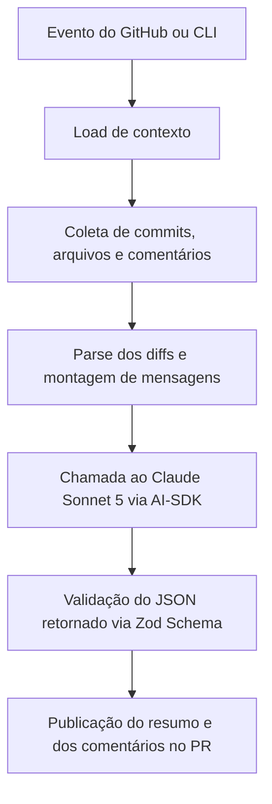

# Documentação técnica da implementação do PR Review AI

## 1. Visão geral

O repositório implementa uma GitHub Action e um CLI local em TypeScript para automatizar revisões de Pull Requests com apoio de Modelos de Linguagem de Grande Escala (LLMs), utilizando primariamente o modelo **Claude Sonnet 5** (`claude-sonnet-5`) via provedor `@ai-sdk/anthropic`. A ferramenta analisa o conteúdo de Pull Requests, gera resumos executivos, produz comentários acionáveis diretamente nas linhas alteradas do código e responde a comentários de revisão de forma interativa.

A proposta arquitetural foi desenhada para separar claramente três responsabilidades:

- **Captura de Contexto:** Leitura do evento no GitHub Actions ou via API REST no CLI local.
- **Processamento de Diffs e Engenharia de Prompts:** Mapeamento de linhas modificadas (`+`), construção de mensagens e execução de prompts estruturados.
- **Publicação e Idempotência:** Postagem formatada dos resumos e comentários inline no GitHub, utilizando assinaturas HTML invisíveis para evitar duplicação de mensagens.

Na prática, a solução funciona como um pipeline modular:



O objetivo técnico do projeto é servir como uma automação de apoio à engenharia de software que reduz o ruído informacional e acelera o processo de revisão humana, permitindo a comparação empírica de desempenho frente a ferramentas comerciais consolidadas, como o GitHub Copilot Code Review.

## 2. Estrutura do projeto
Os arquivos principais da aplicação estão concentrados em src/, com o build gerado em dist/ e a suíte de testes em src/__tests__/.

```text
src/
  main.ts                 -> Ponto de entrada da GitHub Action (roteamento de eventos)
  cli.ts                  -> Interface de linha de comando para testes locais e modo dry-run
  config.ts               -> Leitura, validação de variáveis de ambiente e regras de estilo
  context.ts              -> Abstração do contexto do GitHub Actions e modo debug
  octokit.ts              -> Cliente GitHub API com suporte a retry e tratamento de throttling
  pull_request.ts         -> Fluxo principal de análise e revisão de PR
  pull_request_comment.ts -> Fluxo de resposta interativa a threads de comentário
  prompts.ts              -> Definição dos prompts do sistema, usuários e schemas Zod
  ai.ts                   -> Seleção de provedores, inferência e validação de saída da IA
  diff.ts                 -> Parsing de hunks, numeração de linhas e formatação de patches
  messages.ts             -> Montagem das mensagens de resumo, carregamento e review
  comments.ts             -> Gerenciamento de assinaturas invisíveis, payloads e idempotência
  providers/
    ai-sdk.ts             -> Integração com Anthropic (Claude Sonnet 5), OpenAI e Google via AI SDK
    sapaicore.ts          -> Implementação complementar para o SAP AI Core
```

Outros arquivos essenciais do repositório:

- `action.yml`: Definição dos inputs e do ponto de execução da GitHub Action (`dist/index.js`).

- `package.json`: Scripts de build (`npm run build`), execução local e suíte de testes Jest.

- `README.md`: Guia rápido de configuração, exemplos de workflow e variáveis de ambiente.

- `src/__tests__/`: Testes unitários cobrindo configuração, parsing de diffs, Octokit e mensagens.

## 3. Ponto de entrada da Action (`src/main.ts`)
O arquivo src/main.ts é a porta de entrada da GitHub Action. Ele lê a variável GITHUB_EVENT_NAME e direciona a execução:

- `pull_request` e `pull_request_target`: Executam `handlePullRequest()` em `pull_request.ts`.

- `pull_request_review_comment`: Executam `handlePullRequestComment()` em `pull_request_comment.ts`.

- Qualquer outro evento gera um aviso de evento não suportado no log da Action.

O módulo intercepta exceções não tratadas e invoca @actions/core.setFailed(), garantindo que o status da checagem no GitHub seja marcado como erro em caso de falha crítica.

## 4. Fluxo principal de revisão de Pull Request (`src/pull_request.ts`)
O módulo src/pull_request.ts orquestra o ciclo completo de análise automatizada de um Pull Request.

### 4.1. Leitura de contexto (`src/context.ts`)
O método loadContext() carrega as informações do evento. Em ambiente de GitHub Actions, utiliza @actions/github.context. Em modo debug ou CLI local, reconstrói o contexto a partir das variáveis de ambiente e faz chamadas REST para recuperar os metadados do PR.

### 4.2. Validação e filtragem inicial
Antes de iniciar o parsing de arquivos, o fluxo valida:

- Se o evento é realmente `pull_request` ou `pull_request_target`.

- Se os dados do PR estão presentes no payload.

- Se a descrição contém instruções para ignorar a revisão (ex.: `@prreview ignore`, `@presubmit skip`).

Essa filtragem evita execuções desnecessárias da Action em momentos indesejados.

### 4.3. Coleta de dados e parsing de diffs
O fluxo consulta a API do GitHub via Octokit para recuperar:

- Lista de commits do PR.

- Comentários de issue pré-existentes (para localização de resumos anteriores).

- Arquivos modificados e patches brutos.

Os diffs dos arquivos são processados por parseFileDiff() em src/diff.ts, dividindo os patches em hunks isolados.

### 4.4. Revisão incremental

Quando a ferramenta identifica a presença de um comentário-resumo gerado em uma rodada anterior (via assinatura invisível HTML), ela ativa o modo incremental:

- Lê o payload JSON embutido no comentário pré-existente.
- Identifica o último commit analisado.
- Filtra apenas os commits e arquivos alterados entre a execução anterior e o `head.sha` atual.

Essa abordagem reduz o consumo de tokens da API da Anthropic e previne refatorações redundantes.

### 4.5. Comentário de carregamento

Antes de invocar o modelo Claude Sonnet 5, o sistema publica ou atualiza um comentário informando que a análise está em andamento (`buildLoadingMessage()`). O comentário lista o intervalo de commits analisado e os arquivos sob revisão.

### 4.6. Geração do resumo executivo

A função `runSummaryPrompt()` em `src/prompts.ts` envia ao Claude Sonnet 5 os diffs formatados, o título, a descrição e os commits. A resposta é validada via Zod e retorna o seguinte JSON estruturado:

- `title`: Título resumido da alteração.
- `description`: Descrição executiva do impacto.
- `files`: Resumo do impacto por arquivo.
- `type`: Categoria do PR (`BUG`, `FEATURE`, `REFRACTOR`, `TESTS`, etc.).

Esse resumo é posteriormente utilizado para atualizar o comentário principal do PR no GitHub.

### 4.7. Geração e curadoria da revisão técnica

A função `runReviewPrompt()` submete os trechos alterados para a análise do Claude Sonnet 5. O prompt instrui o modelo a comentar apenas linhas novas (`+`) com evidência direta de um problema real. Antes da publicação, o código valida o arquivo, remove comentários duplicados, ranqueia os candidatos e aplica limites:

- **Ranqueamento por Criticidade:** Comentários críticos têm prioridade; entre os demais, segurança, bugs, problemas possíveis, desempenho e manutenibilidade recebem pesos decrescentes.
- **Limite de comentários de linha:** São selecionados no máximo 8 comentários não críticos, além de todos os comentários críticos. Assim, o total pode ultrapassar 12 quando houver muitos comentários críticos.
- **Comentários de arquivo:** Comentários sem `end_line` são enviados separadamente e não entram nesse limite.

### 4.8. Modo Dry-Run

O CLI permite a execução com a opção `--dry-run`. Nesse modo, o pipeline executa todas as etapas de parsing e inferência via LLM, mas redireciona a saída formatada para o terminal ou para um arquivo local de saída, sem realizar postagens reais na API do GitHub.

## 5. Fluxo de resposta a comentários de review (`src/pull_request_comment.ts`)

O módulo `src/pull_request_comment.ts` é acionado quando um desenvolvedor responde a um comentário deixado pelo bot em uma thread de revisão:

1. Valida se o comentário pertence a um evento `created`.
2. Ignora mensagens geradas pela própria ferramenta (evitando loops infinitos).
3. Exige que a thread seja relevante, por conter uma assinatura, menção ou marcador reconhecido pela ferramenta.
4. Recupera a thread e localiza o diff do arquivo associado.
5. Executa `runReviewCommentPrompt()` enviando o histórico da conversa e o código-fonte ao Claude Sonnet 5.
6. Se a IA determinar que uma resposta é necessária, publica a réplica como reply na mesma thread.

## 6. Configuração e provedores de IA (`src/config.ts` e `src/ai.ts`)

### 6.1. Variáveis de ambiente obrigatórias

- `GITHUB_TOKEN`: Token de acesso para leitura e escrita na API do GitHub.
- `LLM_MODEL`: Nome obrigatório do modelo utilizado. Os modelos atualmente suportados são `claude-sonnet-4-5`, `claude-sonnet-4-6` e `claude-sonnet-5`.
- `LLM_API_KEY`: Chave de autenticação da API da Anthropic.

As configurações opcionais incluem `LLM_PROVIDER` (atualmente `ai-sdk`), `GITHUB_API_URL` e `GITHUB_SERVER_URL` para GitHub Enterprise Server. A Action também aceita o input `style_guide_rules`, usado para acrescentar regras ao prompt de revisão; no modo CLI/debug, as regras podem ser lidas de `STYLE_GUIDE_RULES`.

### 6.2. Configuração do Provedor Anthropic

O projeto utiliza primariamente o provedor `@ai-sdk/anthropic` para comunicação com o modelo Claude Sonnet 5. O módulo `src/ai.ts` aceita também `LLM_BASE_URL` para instâncias personalizadas ou gateways compatíveis com a API OpenAI.

### 6.3. Validação Estruturada com Zod

Para prevenir retornos malformatados em linguagem natural, as respostas estruturadas da IA são passadas pelo validador Zod. Quando ocorre uma falha de validação do schema, o sistema executa uma nova tentativa exigindo JSON estrito. O fluxo também aceita respostas de revisão envolvidas em uma chave adicional, como `$parameter`, e registra um diagnóstico sanitizado quando a nova tentativa falha.

## 7. Parsing de Diffs e Assinaturas Invisíveis (`src/diff.ts` e `src/comments.ts`)

- **Parse de Hunks (`src/diff.ts`):** O patch é processado linha por linha para identificar marcadores `@@`. As linhas de adição (`+`) são numeradas de acordo com a posição final no arquivo novo, garantindo o alinhamento correto das caixas de comentário inline no GitHub.
- **Idempotência por Assinaturas (`src/comments.ts` e `src/messages.ts`):** Comentários gerados contêm a assinatura invisível `<!-- prreview.ai: comment -->`. O comentário-resumo também contém `<!-- prreview.ai: overview message -->` e um payload entre `<!-- prreview.ai: payload --` e `-- prreview.ai: payload -->`. Essas marcas permitem identificar mensagens próprias, atualizar o resumo existente e executar revisões incrementais sem criar novos resumos a cada execução.

## 8. CLI Local para Testes e Validação Experimental (`src/cli.ts`)

O arquivo `src/cli.ts` fornece uma interface de linha de comando para testar a ferramenta fora da esteira de GitHub Actions.

### Comandos suportados:

- `--list-prs`: Lista os Pull Requests abertos do repositório alvo.
- `--pr <número>`: Executa a análise no PR informado.
- `--dry-run`: Exibe o resumo e os comentários no terminal sem postar no GitHub.
- `--out <caminho>`: Salva a saída textual capturada em um arquivo local. Sem caminho, usa `dry/pr-<número>.txt`.

### Aplicação na Pesquisa Acadêmica (TCC II)

O CLI local foi o instrumento utilizado para rodar a avaliação experimental sobre os seis repositórios de teste da **Apache Software Foundation** (Kafka, Dubbo, Flink, Seata, SkyWalking e RocketMQ), permitindo comparar a precisão e o ruído do **PR Review AI** frente às sugestões do **GitHub Copilot Code Review**.

## 9. Procedimento de Build e Deploy

Como a GitHub Action roda em ambiente Node.js isolado, o repositório compila o código TypeScript e suas dependências em arquivos empacotados. O build gera `dist/index.js` para a Action e `dist/cli.js` para o CLI local.

Para gerar uma nova versão após alterações no código-fonte:

```bash
# Instalar dependências do projeto
npm install

# Executar a suíte de testes unitários com Jest
npm test

# Compilar o pacote único para produção em dist/
npm run build
```

O arquivo `dist/index.js` gerado pelo comando de build deve ser commitado no repositório Git para que a GitHub Action seja executada corretamente pelos repositórios que consumirem a ferramenta. O `dist/cli.js` também é necessário para executar o comando `review` após o build.