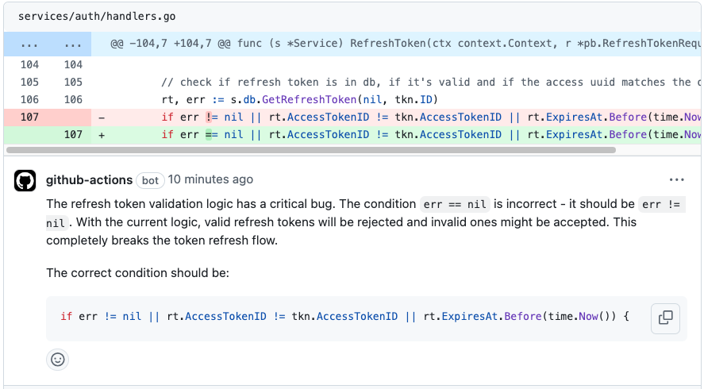
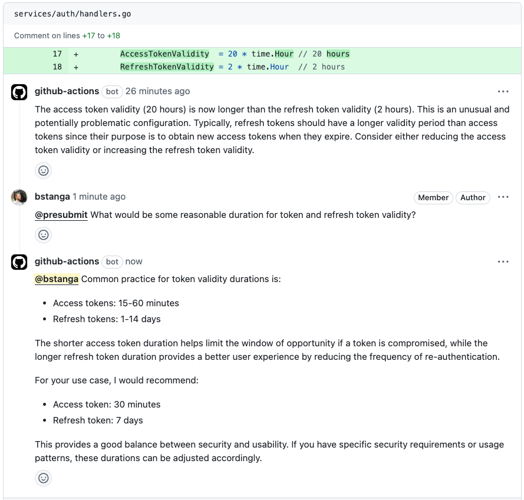

<div align="center">
  <h1>
    PR Review AI
  </h1>
  
  <p><em>Revisões de PR inteligentes, instantâneas e com consciência de contexto</em></p>

[](https://github.com/thallesasv/pullRequestCodeReview/stargazers) &nbsp;
[](https://github.com/thallesasv/pullRequestCodeReview/commits) &nbsp;
[](https://github.com/thallesasv/pullRequestCodeReview/blob/main/LICENSE) &nbsp;

</div>

<br/>

Otimize seu processo de revisão de código com o PR Review AI, que detecta bugs, sugere melhorias e fornece um resumo relevante, tudo isso antes da primeira análise humana.

- 🔍 **Análise instantânea e aprofundada de PRs**: Detecta bugs, falhas de segurança e oportunidades de otimização em tempo real
- 🎯 **Foque no que importa**: Deixe a IA cuidar do básico enquanto pessoas focam em arquitetura e lógica complexa
- ✨ **Geração de título e descrição**: Economize tempo deixando a IA gerar título e descrição relevantes para seu PR
- 💬 **Interativo e inteligente**: Responde perguntas e gera sugestões de código diretamente no seu PR
- ⚡ **Configuração ultrarrápida**: Funciona em 2 minutos com GitHub Actions

<br/>

> 🤝 **Observação**: O PR Review AI foi criado para complementar revisores humanos, não para substituí-los. Ele ajuda a identificar problemas de segurança e bugs logo no início, além de fornecer contexto sobre a mudança como um todo, tornando a revisão humana mais eficiente.

<br/>

## Veja em ação

> 💡 Veja um exemplo completo de revisão de PR nas imagens abaixo.

A análise automatizada detecta problemas potenciais e fornece insights acionáveis:

<div align="left">
  <a href="https://github.com/thallesasv/pullRequestCodeReview/pulls">
    
  </a>
</div>

<br/>

Discussões interativas ajudam a esclarecer detalhes de implementação:

<div align="left">
  <a href="https://github.com/thallesasv/pullRequestCodeReview/pulls">
    
  </a>
</div>

<br/>

## Uso

### Passo 1: Adicione o segredo LLM_API_KEY

1. Vá em Settings do seu repositório > Secrets and Variables > Actions
2. Clique em "New repository secret"
3. Adicione um novo segredo com:
   - Nome: `LLM_API_KEY`
   - Valor: sua chave de API de um destes provedores:
     - [Anthropic Console](https://console.anthropic.com/) (Claude)
     - [OpenAI API](https://platform.openai.com/api-keys) (GPT-4)
     - [Google AI Studio](https://aistudio.google.com/app/apikeys) (Gemini)

### Passo 2: Crie o workflow do GitHub

Adicione esta GitHub Action ao seu repositório criando `.github/workflows/pr-review-ai.yml`:

```yaml
name: PR Review AI

permissions:
  contents: read
  pull-requests: write
  issues: write

on:
  pull_request_target:
    types: [opened, synchronize]
  pull_request_review_comment:
    types: [created]

jobs:
  review:
    runs-on: ubuntu-latest
    steps:
      - name: Check required secrets
        run: |
          if [ -z "${{ secrets.LLM_API_KEY }}" ]; then
            echo "Error: LLM_API_KEY secret is not configured"
            exit 1
          fi
      - uses: thallesasv/pullRequestCodeReview@main
        env:
          GITHUB_TOKEN: ${{ secrets.GITHUB_TOKEN }}
          LLM_API_KEY: ${{ secrets.LLM_API_KEY }}
          LLM_MODEL: "claude-sonnet-4-5"
```

A action requer:

- `GITHUB_TOKEN`: Fornecido automaticamente pelo GitHub Actions
- `LLM_API_KEY`: Sua chave de API (adicionada no passo 1)
- `LLM_MODEL`: Qual modelo LLM usar. Garanta que o modelo seja [compatível](./src/ai.ts) e corresponda ao `LLM_API_KEY`.
- `LLM_BASE_URL` (opcional): URL base para provedores compatíveis com OpenAI ao usar `LLM_PROVIDER=ai-sdk` (ex.: `https://openrouter.ai/api/v1` para OpenRouter).

### Usando provedores compatíveis com OpenAI

Para usar OpenRouter ou outros provedores compatíveis com OpenAI com o provedor `ai-sdk`, adicione a variável de ambiente `LLM_BASE_URL`:

```yaml
      - uses: thallesasv/pullRequestCodeReview@main
        env:
          GITHUB_TOKEN: ${{ secrets.GITHUB_TOKEN }}
          LLM_API_KEY: ${{ secrets.LLM_API_KEY }}
          LLM_MODEL: "openai/gpt-4o-mini"
          LLM_PROVIDER: "ai-sdk"
          LLM_BASE_URL: "https://openrouter.ai/api/v1"
```

**Observação**: Esta configuração funciona apenas com `LLM_PROVIDER=ai-sdk`. Ela suporta qualquer API compatível com OpenAI, incluindo OpenRouter, Anyscale, Together AI e outras.

### Suporte ao GitHub Enterprise Server

Se você usa GitHub Enterprise Server, pode configurar a action para funcionar com sua instância adicionando estas variáveis de ambiente:

```yaml
      - uses: thallesasv/pullRequestCodeReview@main
        env:
          GITHUB_API_URL: "https://github.example.com/api/v3"
          GITHUB_SERVER_URL: "https://github.example.com"
```

Você também pode configurar essas opções usando parâmetros de entrada:

```yaml
      - uses: thallesasv/pullRequestCodeReview@main
        with:
          github_api_url: "https://github.example.com/api/v3"
          github_server_url: "https://github.example.com"
```

Certifique-se de substituir `https://github.example.com` pela URL real do seu GitHub Enterprise Server.

<br/>

## Recursos

### 🤖 Revisões inteligentes

- **Análise aprofundada**: Revisão linha a linha com sugestões conscientes de contexto
- **Resumo automático de PR**: Resumos concisos e relevantes das mudanças
- **Qualidade de código**: Detecta bugs, antipadrões e problemas de estilo
- **Interativo**: Responde perguntas e esclarecimentos nos comentários

### 🛡️ Segurança e qualidade

- **Detecção de vulnerabilidades**: Detecta problemas de segurança e segredos
  vazados
- **Boas práticas**: Aplica padrões de código e diretrizes de
  segurança
- **Performance**: Identifica possíveis gargalos e otimizações
- **Documentação**: Garante documentação adequada e clareza do código

### ⚙️ Configurável

- Mencione `@prreview` no título do PR para geração automática
- Desative revisões com o comentário `@prreview ignore`
- Profundidade da revisão e áreas de foco configuráveis
- Regras e preferências personalizáveis

### ⚡ Integração sem atrito

- Configuração em 2 minutos com GitHub Actions
- Funciona com os principais provedores de LLM (Claude, GPT-4, Gemini)
- Feedback instantâneo em cada PR
- Zero manutenção necessária

<br/>

## Testes locais com CLI (Dry-Run)

Execute o revisor localmente em PRs reais usando sua autenticação do GitHub.

### Pré-requisitos

- Node.js 18+
- GitHub CLI autenticado: `gh auth login`
- Arquivo `.env` na raiz do repositório com:
  - `LLM_API_KEY=...` (sua chave de API)
  - `LLM_MODEL=...` (ex.: `claude-3-5-sonnet-20241022`, `gpt-4o-mini`)
  - Opcional: `LLM_PROVIDER=ai-sdk` (padrão)
  - Opcional: `LLM_BASE_URL=...` (para provedores compatíveis com OpenAI, como OpenRouter)

### Build

```bash
pnpm install
pnpm build
```

### Comandos

**Listar PRs:**
```bash
pnpm review -- --list-prs --state open --limit 5
```

**Revisar um PR (dry-run):**
```bash
pnpm review -- --pr 123 --dry-run
```

**Salvar saída em arquivo:**
```bash
# Gera automaticamente o nome do arquivo: dry/pr-123.txt
pnpm review -- --pr 123 --dry-run --out

# Caminho de saída personalizado
pnpm review -- --pr 123 --dry-run --out my-review.txt
```

**Especificar repositório:**
```bash
pnpm review -- --pr 123 --owner myorg --repo myrepo --dry-run
```

Ou defina no `.env`:
```env
GITHUB_REPOSITORY=myorg/myrepo
```

### Observações

- Usa automaticamente seu `gh auth token`
- O modo `--dry-run` ignora todas as escritas na API do GitHub e registra o que seria publicado
- Sem `--dry-run`, a revisão será publicada no GitHub
- O padrão é o repositório da variável `GITHUB_REPOSITORY` ou `thallesasv/pullRequestCodeReview`

<br/>

## Mostre seu apoio! ⭐

Se você considera o PR Review AI útil para melhorar o processo de revisão:

- **Dê uma estrela neste repositório** para mostrar seu apoio e ajudar outras pessoas a descobri-lo
- Compartilhe sua experiência criando uma [GitHub Issue](https://github.com/thallesasv/pullRequestCodeReview/issues)
- Considere [contribuir](CONTRIBUTING.md) para deixá-lo ainda melhor
